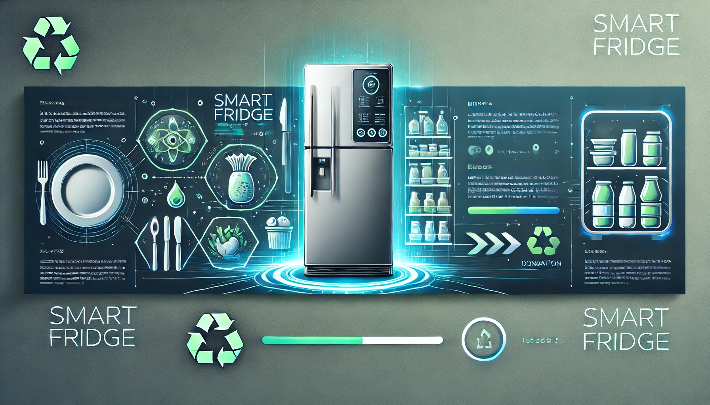

# 🌍 Smart Fridge - A Step Towards Reducing Food Waste 🍏

  
*Making food waste management as easy as opening your refrigerator!*

---

## 📌 Table of Contents
- [🌍 Vision](#-vision)
- [⚙️ How Does It Work?](#️-how-does-it-work)
- [📂 About This Repository](#-about-this-repository)
- [💻 About the Code](#-about-the-code)
- [📜 License](#-license)
- [🤝 Contributing](#-contributing)

---

## 🌍 Vision
Food waste is a pressing global issue, with approximately **1.3 billion tons** of food wasted annually, according to the **United Nations Food and Agriculture Organization (FAO)**.  
This accounts for **one-third** of all food produced for human consumption, while nearly **690 million people** suffer from hunger worldwide.  

💡 **Smart Fridge aims to combat food waste efficiently by creating a digital twin of your fridge to monitor products before they expire.**

---

## ⚙️ How Does It Work?

🔹 The **Smart Fridge** monitors expiring products and notifies users if an item is close to expiration.  
🔹 If the user agrees to donate, they are added to a donor list stored on the server.  
🔹 The server then solves the **traveler salesman problem** to optimize the shortest collection route for a delivery operator.  
🔹 Collected products are then distributed to local **community kitchens** 🏡🍽.

### 🏗 **Smart Fridge Components:**
✅ **Internal Monitor Unit:** Displays fridge status and monitors temperature every minute.  
✅ **External Monitor Unit:** Equipped with a motion sensor, camera, and a sliding switch.  

### 🚀 **User Interaction Flow:**
1️⃣ **Choose Mode:** `INSERT` (adding groceries) or `EXTRACT` (taking food out).  
2️⃣ **Stand in front of the fridge.**  
3️⃣ **Scan the barcode** of the product.  
4️⃣ **Scan the expiry date.**  
5️⃣ **Insert or remove the product.**  

---

## 📂 About This Repository

📌 This repository contains:
- **`src/`** → Code running on the **bridge**
- **`ino/`** → Code for the **Arduino**
- **`images/`** → Sample images
- **`tests/`** → Test cases to ensure proper functionality

---

## 💻 About the Code

1️⃣ The **bridge** starts serial communication with the **Arduino**.  
2️⃣ At startup, the Arduino sends **GPS data** to the server for location tracking.  
3️⃣ The Arduino then detects **motion in front of the fridge** and activates the **camera**.  
4️⃣ The camera scans:
   - **Barcode** ▏▍▏▏▍▏▏▏▍▏

   - **Expiry date** ⏳  

5️⃣ The system determines if the user is **inserting** or **extracting** an item and sends the appropriate **API request** (`POST` or `DELETE`).  
6️⃣ Once done, the system automatically **turns off the camera** after a set duration.

---

## 📜 License
This project is licensed under the **MIT License**. See the `LICENSE` file for details.

---

## 🤝 Contributing
We welcome contributions! Feel free to:
1. Fork the repository 🍴
2. Create a feature branch 🌿
3. Submit a Pull Request 🔄

---

🔗 **Follow us for updates!** 🌍✨

📧 Contact: [filippogib@gmail.com](mailto:your.email@example.com)  
📧 Contact: [terry.campo.2002@gmail.com](mailto:your.email@example.com)  
📧 Contact: [gio.forti.2002@gmail.com](mailto:your.email@example.com)  
📧 Contact: [isidoromattia@gmail.com](mailto:your.email@example.com)

